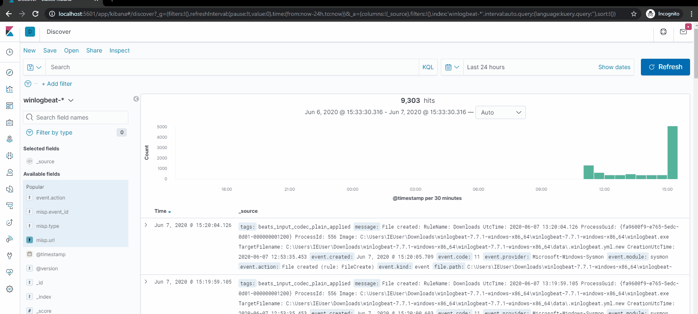

# MISP2memcached

Load IOCs from MISP Threat sharing platform to memcached. Use Logstash to enrich your SIEM logs.



Examples are provided for Elasticsearch based SIEM with ECS mapping, but you can modify the examples to work with your setup.

Check out the [Getting started](./docs/getting_started.md) if you want to see a simple use case on how to enrich data from Sysmon shipped by Winlogbeat.

## Requirements

- pymemcahe
- requests
- PyYAML

## Installation

After configuration simply run `misp2memcahed.py` as a cron job.

## Configuration

Basic settings for basic memcached setup. Clusters are not currently supported.

```yaml
memcached:
  host: 127.0.0.1
  port: 11211
```

MISP configuration. Set `ignore_cert_errors` to `true` if working with self-signed certificate. Don't use for production. 

When MISP2memcached fails to find `misp-stats` key in memcached or `misp-stats` is 0 `initial_event_timestamp` value is used to do the initial
load of events from MISP. This will load all events that were modified in the specified timeframe. 

On normal run when key `misp-stats` is present and is not 0 `refresh_event_timestamp` value is used to only load events modified in
that timeframe. You should configure this value based on your configuration of fetch_feeds or pull_all scheduled tasks in MISP.
```yaml
misp:
  url: https://misp.localhost
  token: "fA3rESKxzAH2XfUyHAfRDTNcovlFDYQd4mc4kdCf"
  ignore_cert_errors: false
  initial_event_timestamp: 356d
  refresh_event_timestamp: 1h
```

IOCs are split into three arbitrary categories:
- hash (misp-md5, misp-sha1, misp-sha256, misp-sha512, misp-imphash)
- network (misp-ip, misp-domain)
- web (misp-url)

If the `enabled` variable is set to `true` data will be queried in MISP and loaded into memcached. Expires sets the  
```yaml
hash:
  enabled: true
  expires: 0
```

## Example configuration

```yaml
memcached:
  host: 127.0.0.1
  port: 11211
misp:
  url: https://misp.local
  token: "fA3rESKxzAH2XfUyHAfRDTNcovlFDYQd4mc4kdCf"
  ignore_cert_errors: false
  initial_event_timestamp: 30d
  refresh_event_timestamp: 5m
hash:
  enabled: true
  expires: 0
network:
  enabled: true
  expires: 0
web:
  enabled: true
  expires: 0
```

## Supported IOCs

| Memcached namespace | MISP types                                             | Comment                                       |
|---------------------|--------------------------------------------------------|-----------------------------------------------|
| misp-md5            | md5,filename\|md5                                      | Filename is ignored                           |
| misp-sha1           | sha1,filename\|sha1                                    | Filename is ignored                           |
| misp-sha256         | sha256, filename\|sha256                               | Filename is ignored                           |
| misp-sha512         | sha512, filename\|sha512                               | Filename is ignored                           |
| misp-imphash        | imphash, filename\|imphash                             | Filename is ignored                           |
| misp-ip             | ip-dst, ip-src, ip-dst\|port, ip-src\|port, domain\|ip | Port is ignored, Domain goes into misp-domain |
| misp-domain         | domain, domain\|ip                                     | IP goes into misp-ip                          |
| misp-url            | url                                                    |                                               |

## Known problems

- Memcached doesn't allow whitespace characters in keys. This makes it unusable for registry keys, user agents etc. without adding some form of encoding
- Memcached TLS and authentication support is kind of unintuitive and a pain to configure. Redis would be much better fit, 
unfortunately there is no redis filter plugin for Logstash.
- Must use custom ruby filter to parse results from memcached in Logstash, this is not ideal, but unavoidable. Again redis
would probably be a better fit.
- Probably many other

## Based on

This tool was inspired by 

[securitydistractions/elastiMISPstash](https://github.com/securitydistractions/elastimispstash)

[CERN PocketSOC](https://gitlab.cern.ch/wlcg-soc-wg/PocketSOC/-/blob/master/components/zeek/config/memcached_misp.sh)
