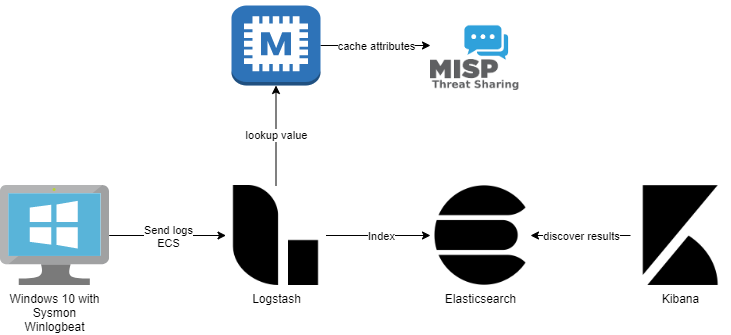
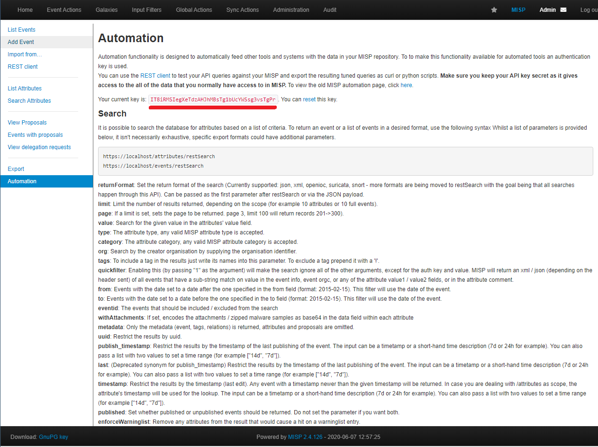
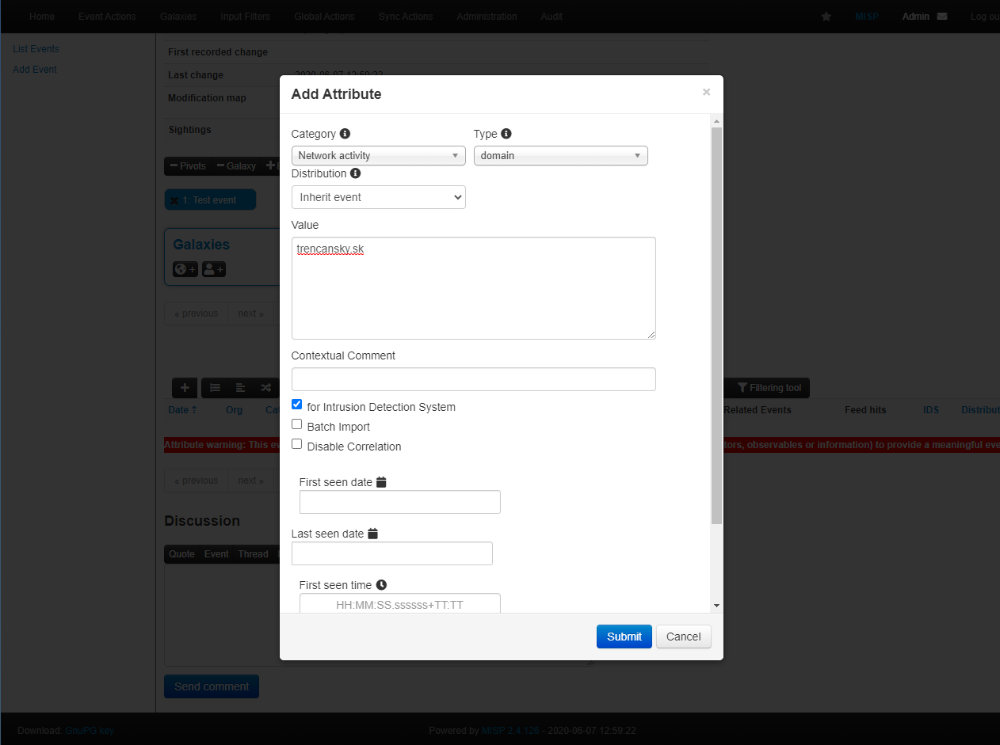
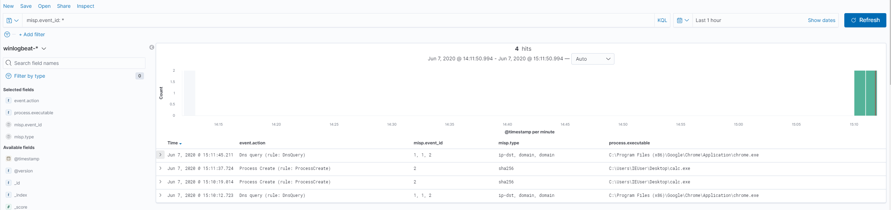
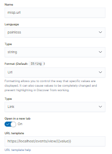

# Enriching Windows Event logs

## Environment

In this example we will be using the following components:

- Python 3
- Windows 10 workstation
- Sysmon (I'm using [SwiftOnSecurity/sysmon-config](https://github.com/SwiftOnSecurity/sysmon-config))
- Winlogbeat 7.X
- Logstash 7.X
- Elasticsearch 7.X
- Kibana 7.X
- Memcached
- MISP

We won't go into details on how to install or setup individual components if necessary please consult the appropriate documentation.
Everything except the Windows 10 VM can be run from Docker container, if you want to try this. 
(If you have separate docker host for Linux and Windows you can run everything from docker)



## Prerequisites

- Running MISP instance
- Running memcached
- Running Elasticsearch and Kibana
- [Installed Winlogbeat template in Elasticsearch](https://www.elastic.co/guide/en/beats/winlogbeat/current/winlogbeat-template.html)
- Windows 10 workstation with installed Sysmon and Winlogbeat
- Running Logstash (no pipeline)

## MISP2memcached installation and configuration

First we will download, install and configure MISP2memcached. Clone the MISP2memcached repository
```bash
git clone https://github.com/j91321/MISP2memcached.git
```

Creating virtual environment for python3 is optional but highly recommended.
```bash
python3 -m venv venv-misp2memcached
source venv-misp2memcached/bin/activate
cd ./MISP2memcached
```

Next we will install required packages using pip
```bash
pip install -r requirements.txt
```

Copy config.yml.example as config.yml
```bash
cp config.yml.example config.yml
```

Now we will log into the MISP instance and obtain the API key.



We will edit `config.yml` and add the API key under `misp.token` and change `misp.url` to point to out MISP instance.
We have also set `misp.ignore_cert_errors` to `true` because this is a development MISP instance and it doesn't have proper SSL
certificate, **please do not disable SSL verification in production**.

```yaml
memcached:
  host: 127.0.0.1
  port: 11211
misp:
  url: https://127.0.0.1
  token: "IT8iRMSIegXeTdzAHJhMBsTg1bUcYWSsg3vsTgPr"
  ignore_cert_errors: true
  initial_event_timestamp: 365d
  refresh_event_timestamp: 1h
hash:
  enabled: true
  expires: 0
network:
  enabled: true
  expires: 0
web:
  enabled: true
  expires: 0
```

As a test we will create two Events in MISP with some attributes, if you already have events in your MISP which you want to use make sure the `for IDS` flag is checked.

These events will contain attributes with type `domain`, `ip-dst`, `sha256`. We're using the domain and ip of our server as an IoC and sha256 hash of calc.exe



Now we can run `misp2memcached.py` and load the attributes into memcached. No logs will be printed for now, but you can verify the results by connecting to the memcached.
```yaml
(venv-misp2memcached) j91321@DESKTOP:/mnt/c/Users/j91321/Documents/work/MISP2memcached$ ./misp2memcached.py
(venv-misp2memcached) j91321@DESKTOP:/mnt/c/Users/j91321/Documents/work/MISP2memcached$ telnet localhost 11211
Trying 127.0.0.1...
Connected to localhost.
Escape character is '^]'.
get misp-stats
VALUE misp-stats 0 1
2
END

get misp-domain:trencansky.sk
VALUE misp-domain:trencansky.sk 0 17
1#domain,2#domain
END
```

The `misp-stats` key shows you how many attributes were loaded into the memcached. (This value is not affected when key expires). The key has format `namespace:key` in my case `misp-domain:trencansky.sk`. This key has
value `1#domain,2#domain` this is a comma separated list events and types which contain this key the value has following format `event_id#misp_type`. 

Now that we have IoC from MISP in memcached we can setup Logstash pipeline.

First copy `process_ioc.rb` to `/etc/logstash`, alternatively you can use different path, but you must modify the logstash filter later accordingly. This is custom ruby filter used for parsing the result from memcached described above.
```bash
cp process_ioc.rb /etc/logstash/
```

Now our pipeline will consist of three components input, filter and output.

First create [01-input.conf](./examples/01-input.conf) in `/etc/logstash/conf.d/` (or your path for pipelines). It's a simple beats input.

```logstash
input {
  beats {
    port => 5044
  }
}
```

Next we will create [03-output.conf](./examples/03-output.conf). I'm creating a minimalistic input and output configuration. When using in production
make sure to have Security setup on your Elasticsearch. I also recommend securing Beats-Logstash communication with SSL according to the documentation.

```logstash
output {
    elasticsearch {
        hosts => ["http://elasticsearch:9200"]
        index => "winlogbeat-7.7.1"
    }
}
```

At last we will create [02-filter.conf](./examples/02-filter.conf) this actually contains the filters used for enriching winlogbeat data.
```logstash
filter{
    if [destination][ip] {
        memcached {
            hosts => ["memcached:11211"]
            namespace => "misp-ip"
            get => {
                "%{[destination][ip]}" => "[enrich][tmp]"
            }
        }
        if [enrich][tmp] {
            ruby {
                path => "/etc/logstash/process_ioc.rb"
            }
            mutate {
                remove_field => [ "[enrich]" ]
            }
        }
    }
    if [dns][resolved_ip] {
        memcached {
            hosts => ["memcached:11211"]
            namespace => "misp-ip"
            get => {
                "%{[dns][resolved_ip]}" => "[enrich][tmp]"
            }
        }
        if [enrich][tmp] {
            ruby {
                path => "/etc/logstash/process_ioc.rb"
            }
            mutate {
                remove_field => [ "[enrich]" ]
            }
        }
    }
    if [dns][question][registered_domain] {
        memcached {
            hosts => ["memcached:11211"]
            namespace => "misp-domain"
            get => {
                "%{[dns][question][registered_domain]}" => "[enrich][tmp]"
            }
        }
        if [enrich][tmp] {
            ruby {
                path => "/etc/logstash/process_ioc.rb"
            }
            mutate {
                remove_field => [ "[enrich]" ]
            }
        }
    }
    if [hash][sha256] {
        memcached {
            hosts => ["memcached:11211"]
            namespace => "misp-sha256"
            get => {
                "%{[hash][sha256]}" => "[enrich][tmp]"
            }
        }
        if [enrich][tmp] {
            ruby {
                path => "/etc/logstash/process_ioc.rb"
            }
            mutate {
                remove_field => [ "[enrich]" ]
            }
        }
    }
}
```

There is a section for each field we want to lookup in memcached. Like this:

```logstash
    if [destination][ip] {
        memcached {
            hosts => ["memcached:11211"]
            namespace => "misp-ip"
            get => {
                "%{[destination][ip]}" => "[enrich][tmp]"
            }
        }
        if [enrich][tmp] {
            ruby {
                path => "/etc/logstash/process_ioc.rb"
            }
            mutate {
                remove_field => [ "[enrich]" ]
            }
        }
    }
```

If the field exists, lookup it's value in memcached and store result in `enrich.tmp`, if `enrich.tmp` exists (memcached returned result), parse the result with `process_ioc.rb` and remove `enrich.tmp`.

This is repeated for every field, namespaces are changed accordingly.

| Memcached namespace | MISP types                                             | Comment                                       |
|---------------------|--------------------------------------------------------|-----------------------------------------------|
| misp-md5            | md5,filename\|md5                                      | Filename is ignored                           |
| misp-sha1           | sha1,filename\|sha1                                    | Filename is ignored                           |
| misp-sha256         | sha256, filename\|sha256                               | Filename is ignored                           |
| misp-sha512         | sha512, filename\|sha512                               | Filename is ignored                           |
| misp-imphash        | imphash, filename\|imphash                             | Filename is ignored                           |
| misp-ip             | ip-dst, ip-src, ip-dst\|port, ip-src\|port, domain\|ip | Port is ignored, Domain goes into misp-domain |
| misp-domain         | domain, domain\|ip                                     | IP goes into misp-ip                          |
| misp-url            | url                                                    |                                               |

Restart the logstash for the changes to be applied, we will now go into Windows VM and start `calc.exe` and visit `trencansky.sk` using
Chrome to generate logs matching the event attributes.

Now new fields `misp.event_id` and `misp.type` should be visible in Kibana. Don't forget to refresh the index pattern for Kibana to detect the correct mapping.

We can use KQL `misp.event_id: *` to find all documents where `misp.event_id` exists.



Now to make the analyst user experience a bit better, we will add a scripted field with URL pointing to our MISP event.

We can modify the index pattern in Kibana *Management->Index patterns*. Click the index pattern, in our case *winlogbeat-** move to Scripted fields and click
*Add scripted field*.

Fill out the form like this:

- Name: `misp.url`
- Language: `painless`
- Type: `string`
- Format: `Url`
- Type: `Link`
- Open in a new tab: `true`
- URL template: `https://localhost/events/view/{{value}}`
- Script: `doc['misp.event_id']`
 
 Modify the URL template to point to the MISP instance. The `{{value}}` will be replaced by values from `misp.event_id` field.



Save the scripted field, now we can go into discovery use KQL `misp.event_id: *` again and see that the documents now have misp.url field which is a clickable URL that opens new tab with the matching event in MISP. (You need to be logged in).


